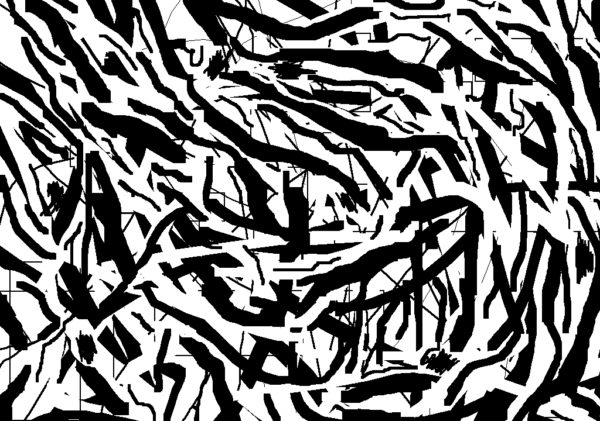
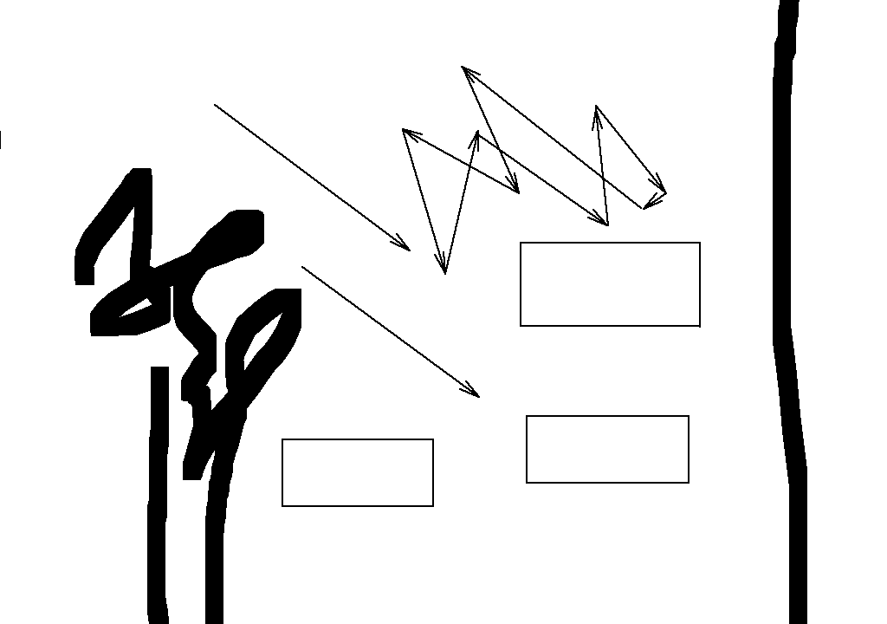
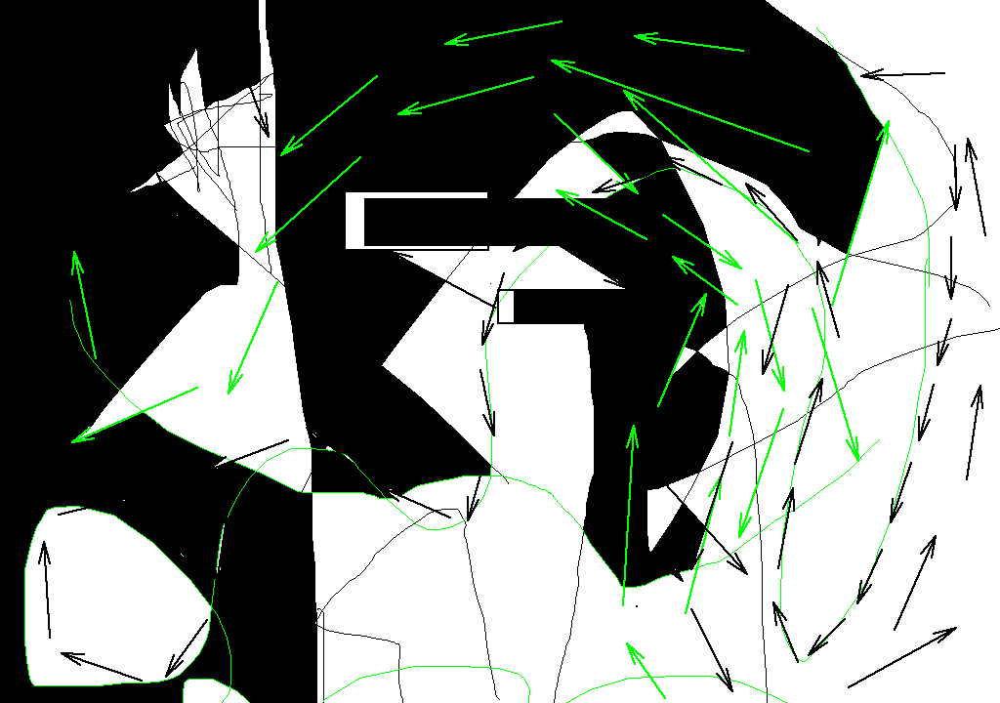
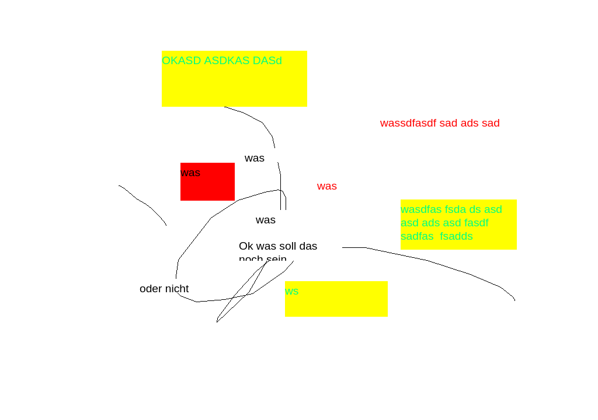
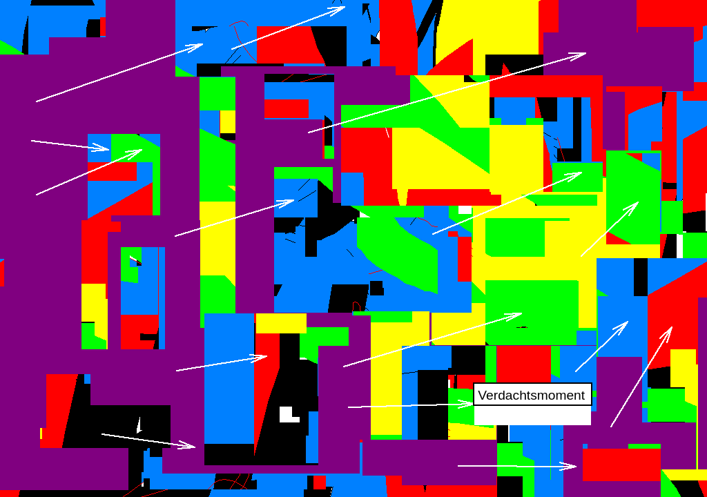
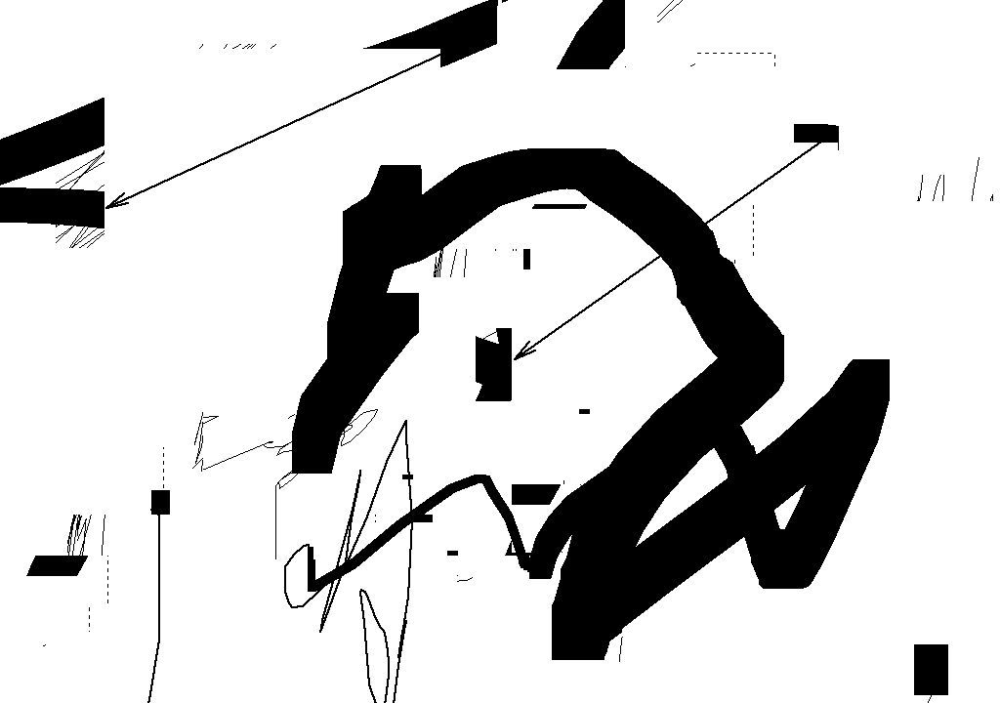

[__Try it here!__](https://hahanein.github.io/dpaint/)

# DPAINT

A JavaScript rewrite of _MSPAINT.EXE_ staying truthy to the original.

## Goals

- Offline first: Save the page to a local directory. Open it in your favorite web browser (Firefox).
- No third-party dependencies: Vanilla JavaScript/TypeScript only.
- Straight forward interaction and behaviour diagram plotting.
- Rad tools and filters not in the original _MSPAINT.EXE_.

## Non-Goals

- Implement _MSPAINT.EXE_ spray paint tool.

---

